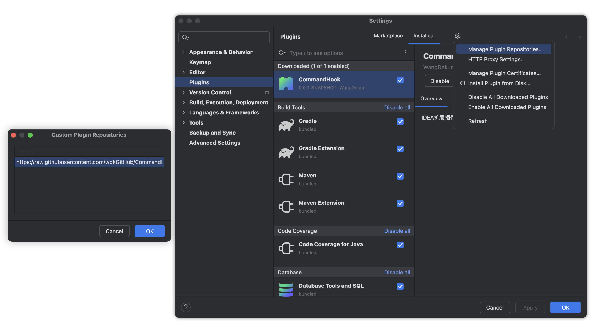

# [自用 IDEA 插件](https://blog.dekun.wang/)

> 无聊学学Kotlin、Github Action 和 顺带使用kotlin重写自用IDEA插件

- `git -open` 用浏览器打开当前远程仓库
- Fork App 打开本地Git仓库
- SourceTree App 打开本地Git仓库
- Typora App 打开Markdown文件

## 使用方法

> 如图添加[仓库地址](https://raw.githubusercontent.com/wdkGitHub/CommandHook/refs/heads/master/updatePlugins.xml)，然后搜索 CommandHook 安装

